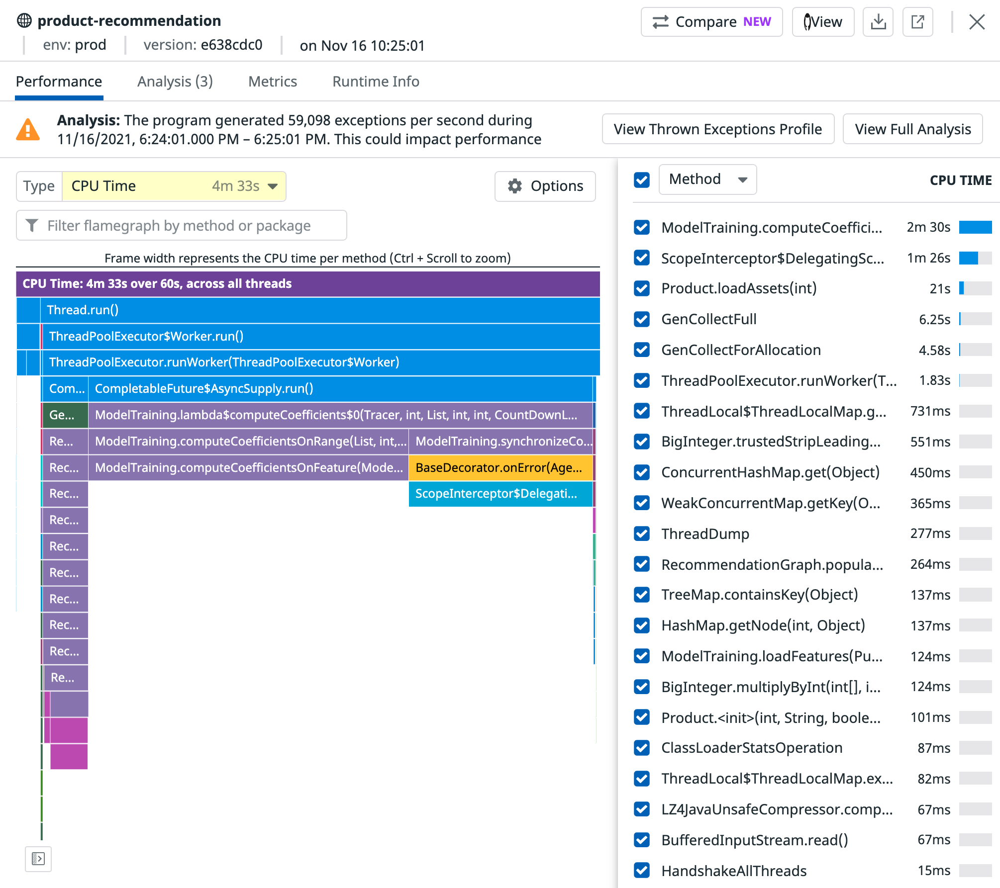

# Diagnose and Optimize CPU performance with Continuous Profiling

The Continuous Profiler in Datadog is an always-on, production code profiler that enables you to analyze code-level performance across your entire environment, with minimal overhead. Profiles reveal which functions (or lines of code) consume the most resources, such as CPU and memory. With this information, you can optimize your code to reduce both your end-user latency and cloud provider costs.

Continuous Profiling in Datadog allows you to do the following:

- visualize all your stack traces in one place
- discover bottlenecks in your code at a glance
- zero in on profiles using tags
- correlate profiles and distributed traces seamlessly
- get actionable insights for performance improvements
- track long-term performance trends

To learn more about Continuous Profiling, you can read the blog posts <a href="https://www.datadoghq.com/blog/datadog-continuous-profiler/" target="_blank">Analyze code performance in production with Datadog Continuous Profiler</a> and <a href="https://www.datadoghq.com/blog/code-optimization-datadog-profile-comparison/" target="_blank">Compare and optimize your code with Datadog Profile Comparison</a>.

Continuous Profiling complements distributed tracing, runtime metrics, log analytics, Synthetic Monitoring, and Real User Monitoring in your application developer’s toolkit to make troubleshooting performance issues even faster and simpler. 

In this scenario, you will explore how to diagnose production CPU performance problems in a java application.

Prerequisites: Experience with Application Performance Monitoring in Datadog and basic knowledge of the Java programming langauge.

When you are ready to continue, click **Start Scenario**.