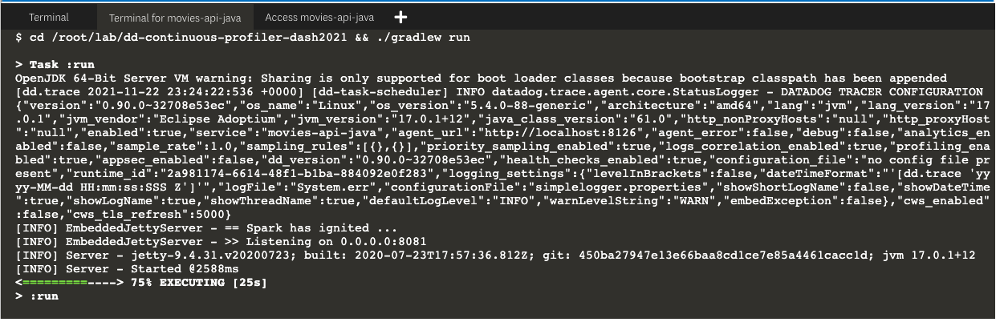

You log into Datadog and configure monitoring the `movies-api-java` service for APM.

1. Click this command `creds`{{execute}} to display the credentials for the Datadog account assigned to you for this scenario.

2. In a new browser window/tab, use the credentials to <a href="https://app.datadoghq.com/account/login" target="_datadog">log into the Datadog account</a>.
    
    NOTE: If the link opens to a Datadog account you're already logged into, log out of that account and log into the account using the credentials in the terminal.

3. Once you have successfully logged into the Datadog account, navigate to <a href="https://app.datadoghq.com/apm/getting-started" target="_datadog">**APM** > **Setup & Configuration**</a>.

4. In the top menu, select **Service Setup**.

5. Under **Where are your traces coming from?**, select **Container-Based**.

6. Under **Choose your Environment and Application Language**, select **docker**. Then, select **Same host** and **java**.

7. Under **Run the Agent**, you'll see a code block to enable trace collection in your environment. This code block is below. Click the code block below to run the code directly in the terminal.

  ```
  docker run -d \
    -v /var/run/docker.sock:/var/run/docker.sock:ro \
    -v /proc/:/host/proc/:ro \
    -v /sys/fs/cgroup/:/host/sys/fs/cgroup:ro \
    -p 127.0.0.1:8126:8126/tcp \
    -e DD_API_KEY=$DD_API_KEY \
    datadog/agent:latest
  ```{{execute T1}}

    💡 Tip: After a few seconds, you can check if the agent is healthy using this command:

  ``docker exec -it `docker ps --filter "expose=8126" -q` agent status``{{execute T1}}

8. Under **Install the Java client**, you'll see a code block to install the Java tracing client. Click the code block below to run the commands in the **Terminal** tab, or you can copy, paste, and run the command in that tab.

  `wget -O dd-java-agent.jar 'https://dtdg.co/latest-java-tracer'`{{execute T1}}

9. Under **Instrument your application**, build the code snippet to automatically instrument your Java application. Set the **Service name** to `movies-api-java`, the **Environment name** to `staging`, and enable all three of **Automatically Inject Trace and Span IDs into Logs**, **Tracing Without Limits**, and **Continuous Profiling**. (You can refere to the <a href="https://docs.datadoghq.com/tracing/profiler/enabling/java/?tab=commandarguments" target="_blank">Enabling the Java Profiler</a> documentation for more details.)

    In the editor on the right, open the Gradle build file by clicking this filename: `dd-continuous-profiler-dash2021/build.gradle`{{open}}.

    The code block below includes the code snippet you built in **Instrument your application**. Click the code block to add the provided arguments as `applicationDefaultJvmArgs` under `build.gradle` on **line 25**:

    <pre class="file" data-filename="dd-continuous-profiler-dash2021/build.gradle" data-target="insert" data-marker="    applicationDefaultJvmArgs = ['-Xmx3g', '-Xms3g']">
         applicationDefaultJvmArgs = [
            '-Xmx3g',
            '-Xms3g',
            '-javaagent:dd-java-agent.jar',
            '-Ddd.profiling.enabled=true',
            '-XX:FlightRecorderOptions=stackdepth=256',
            '-Ddd.logs.injection=true',
            '-Ddd.trace.sample.rate=1',
            '-Ddd.service=movies-api-java',
            '-Ddd.env=staging',
            "-Ddd.version=${new Date().toString()}", // Tag each run with a different version
            '-Ddd.profiling.jfr-template-override-file=dd-profiler-overrides.jfp',
        ]</pre>

10. Now that you've configured the service for APM in Datadog, rerun the service by clicking the command below.

    `cd /root/lab/dd-continuous-profiler-dash2021 && ./gradlew run`{{execute interrupt T2}} (👆_Double click_)

    You should see a `DATADOG TRACER CONFIGURATION` log message that confirms that the application is now collecting data.

    

Now that tracing is set up for the service and Datadog is collecting the trace data, you can start investigating the cause of the slow performance.