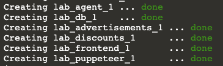

In the terminal on the right, the enviroment is being prepared. You will see a message `Provisioning Complete` along with some login credentials when the environment is prepared.

Click the **IDE** tab on the right. It may take a few seconds to load. Once the IDE loads, open the file `deploy/docker-compose/docker-compose-slow.yml`{{open}} to view the file in the editor. 

This docker-compose file brings the Storedog app online and instruments the Datadog agent and Storedog app services for monitoring with Datadog. 
     
All <a href="https://docs.datadoghq.com/agent/docker/?tab=standard" target="_blank">configuration in a Docker environment</a> is done through environment variables, volumes, and Docker labels.

Because the application is run in a Docker (containerized) environment, the Datadog Agent runs in a container alongside the application containers: `agent`. 
     
Each application service runs in its own Docker container: `discounts`, `frontend`, `advertisements`, and `db`. (The `traffic` service is an extraneuous container for simulated RUM traffic in this scenario.)

Let's configure Datadog RUM for the app.

1. In a new browser window/tab, use the login credentials provided in the terminal to log in to the <a href="https://app.datadoghq.com/account/login" target="_datadog">Datadog account/organization</a> that was created for you for this activity.

    Note: If the credentials are not displayed in the terminal, run the command `creds`{{execute}} in the terminal.

2. To get started with RUM in Datadog, you need to set up a **RUM Application**. Navigate to <a href="https://app.datadoghq.com/rum/list" target="_datadog">**UX Monitoring > Rum Applications**</a>.

3. Click **New Application**.

4. Under **Set your application details**, select **JS** as the **Application type** because you are integrating the app using Javascript.

    Enter **Storedog** as the **Application name**.

    Click **Create New RUM Application**.

5. If you are using NPM to manage dependencies for your project front end, you can integrate RUM using the `@datadog/browser-rum` package. However, here you are just going to add the JavaScript inline, so select the **CDN Sync** tab.

    

    Notice that values for `applicationId` and `clientToken`. You will need these to set up RUM in your application.
    
    Adding RUM to Storedog like this propagates every app user’s session performance information up to Datadog and helps you retain and analyze not only the app’s CWV scores, but also every aspect of performance timing that is relevant to both UX and business concerns.

6. On the right, click the **IDE** tab.  

    Open the file `store-frontend-instrumented-fixed/app/spree/views/layouts/application.html.erb`{{open}}. This Ruby file is the main template for the Storedog app. By integrating the RUM script here, RUM will be available throughout the application.

    **Lines 10-19** are the RUM script in the front end and set the initialization arguments. This code may be slightly outdated (and different) than the current code snippet in the Datadog UI. It will still work.

    Notice that the code snippet includes environment variables for `applicationId` and `clientToken`.

7. Click the **Terminal** tab on the right. Let's set the environment variables for `applicationId` and `clientToken`.
    
    Copy the `applicationId` from the RUM UI page. In the terminal, assign the value you copied to `DD_APPLICATION_ID` using the `export` command: `export DD_APPLICATION_ID=xxxxxxxxxxxxxxxxxxxxxxxxxxxxxxxxxxx`

    Copy the `clientToken` from the RUM UI page. In the terminal, assign the value you copied to `DD_CLIENT_TOKEN` using the `export` command: `export DD_CLIENT_TOKEN=xxxxxxxxxxxxxxxxxxxxxxxxxxxxxxxxxxx`
    
    Run this command to verify that you saved the variables: `echo $DD_APPLICATION_ID $DD_CLIENT_TOKEN`{{execute}}

8. Click `docker-compose up -d`{{execute}} to start the storedog app. Docker will pick up the environment variables you set in the host and pass them along to the containers. Once the app is online, you will see the following in the terminal.

    

Before you start viewing the CWVs for an app in a RUM product, a helpful first step for getting some basic information about your web app’s UX performance is running a synthetic test on the app's performance in a browser. Let's run this test next.