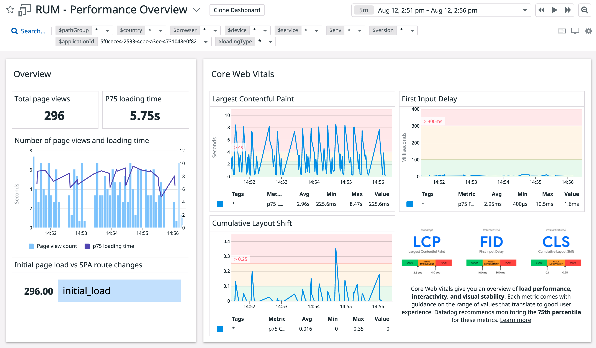
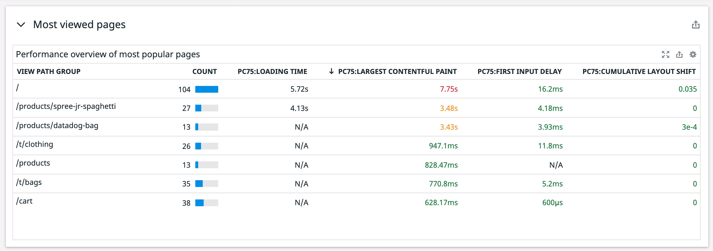
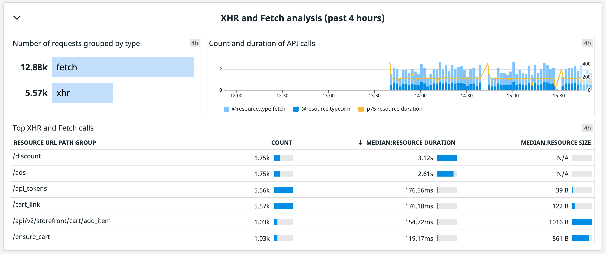
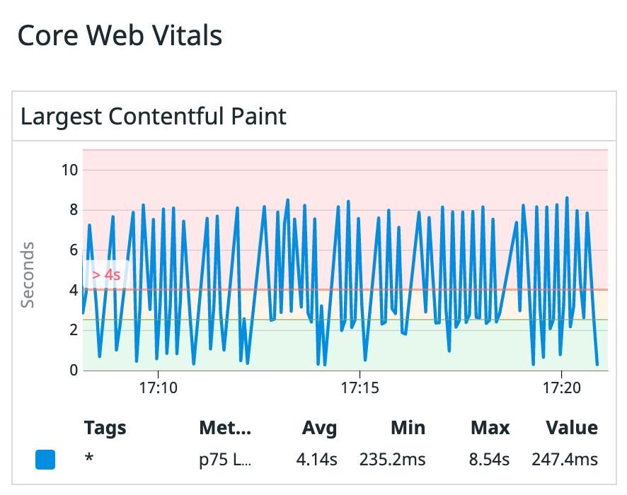

You saw from the browser audit that some of the Storedog app's CWV scores from synthetic browser testing were undesirable.

Let's use Datadog RUM to see how the app is performing and "investigate any critical performance issues.
    
1. Navigate to the <a href="https://app.datadoghq.com/rum/list" target="_datadog">**UX Monitoring > RUM Applications**</a>.

    Change the time range in the upper right to `Past 5 minutes` to zoom in on the most recent events.

2. In the **Storedog** application panel, you will see visualizations for User Sessons, Loading Time, and % of views with errors. Click **Application Overview** for this application.

    Scroll through and view the visualizations. On the left, the top panel displays the Core Web Vitals P75. 

    Above the dashboard area, toggle the **Device Type** to view the data for each option. Notice how the data differs based on device type. Which device has the most **Page View by Version**?

3. In the top menu, click **Dashboards** and select **Performance**.

    In the **Overview** panel, notice the high **P75 loading time**. (The axis for the p75 loading time is on the left.)

    In the **Core Web Vitals** panel, notice that the average **Largest Contentful Paint** score is > 2.5 seconds, which is undesireable for a good user experience.

    

    Let's scroll through the Dashboard and see if you can gain more insight  

    Scroll down to the **Most viewed pages** panel. Click the column label **PC75:LARGEST CONTENTFUL PAINT** to sort the column in descending order. Notice that the **VIEW PATH GROUP** with the highest PC75 LCP score is the **/** path, which is the home page. 

    

    Scroll down to the **Long tasks analysis** panel. In the **P75 long task duration** graph, notice that the Avg duration is in the milliseconds, so the long tasks are not contributing to the high LCP score.  

    Scroll down to the **XHR and Fetch analysis (past 4 hours)** panel. In the **Top XHR and Fetch calls** table, click the **MEDIAN:RESOURCE DURATION** to sort the column in descending order. Notice that the **RESOURCE URL PATH GROUPS** that have the highest duration are **/discount** and **/ad**.

    

It's possible the high LCP scores are related to the calls made to the /discounts and /ads resources during page loads. Let's explore the RUM Events with high LCP performance in more detail to understand why the score is so low and determine how to fix the poor performance.

