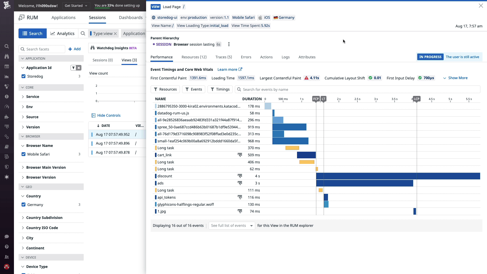
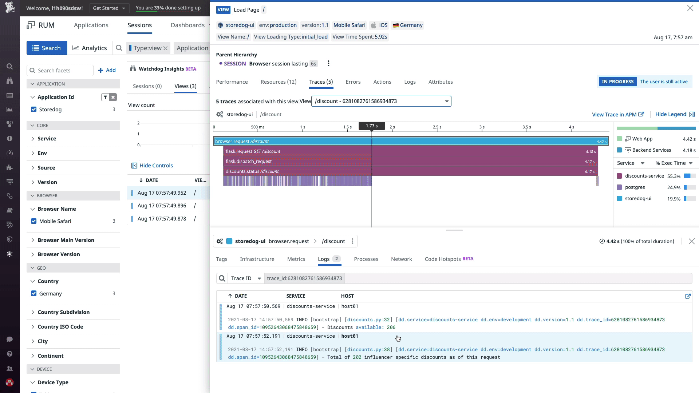

You've found that the home page (**/** VIEW PATH GROUP) has the highest PC75 LCP. You can view the details for the RUM events in the Sessions Explorer, including associated APM traces (which were connected during configuration), to try to find and troubleshoot the cause of the poor performance.

1. In the **Performance Overview** dashboard you were just viewing, scroll down to the **Most viewed pages** panel. Click **/** under the **VIEW PATH GROUP**. In the menu that appears, select **View RUM events**. A new tab will open for the Sessions Explorer.

2. In the Sessions Explorer, notice that the search query contains filters for `Type`, `Application Id`, and `View Path Group`, so that you are only seeing the  `view` events for related to the `/` (homepage) path group in the `Storedog` app. 

3. Scroll down to the list of **Views**. 

    Notice that the **LOADING TIME** for the some of the view is `In Progress`. The data for these views is still bring processed.

    Let's select a View for which the data processing is complete. Click a View that has a time listed under **LOADING TIME**. The RUM events side panel will open.

4. Below the **Performance** tab, notice that the **Largest Contentful Paint** is a > 2.5 seconds and is indicated with a red triangle and exclamation mark. Hover over the LCP value to view the legend. 

    Scroll down and view the RUM waterfall. Notice that many of the bars have of duration of > 1 second. Also, notice the lines for the three CWVs is affected by these durations.
    
    Hover over the bars. Many display a url path starting with `https://...`. These javascript, CSS, and image resources are static resources that are usually not cached during development, but should be cached in production so that they do not slow down the page loads. 
    
    Use the up and down arrow keys on your keyboard to view the details of more view events. Notice that these resources are being requested on almost every home page view. These static resources take too long to be retrieved on each view. Caching will need to be enabled on the frontend to reduce the loading duration of these files.  
    
    Hover over **discount** and **ads** resources for more details. Remember that these were the two resources with the longest median resource durations. Also, notice that APM Traces symbol next to these resourses. You may need to view the associated backend traces for these resources in order to troubleshoot the issue.

    

5. Let's start with troubleshooting the resources that aren't being cached.

    Click the **IDE** tab on the right, then click `config.rb`{{open}} to open the file. Update **Line 3** so that `enable_cache = true`. The change will be automatically saved. 

    Click the **Terminal** tab on the right. Click `docker-compose restart frontend`{{execute}} to run the command in the terminal. Although, the change was saved, the docker container running the frontend service has to be restarted so that the change is applied to the app.

    Click the open browser tab with the **Performance Overview** dashboard. Wait for about 2 minutes as new data is collected. 
    
    Notice that the average **Largest Contentful Paint** score has decreased and is now closer to 2.5 seconds, the desired threshold value.

    

    Click the open browser tab with the Sessions Explorer. Scroll down to the list of **Views**. Notice that the times listed under the **LOADING TIME** are much lower than the earlier values. Click one of the views with a listed **LOADING TIME** to open the RUM events side panel. 

    Scroll down and view the waterfall below the **Performance** tab. Notice that there are fewer bars for the frontend resources. Now that those resources are being cached, the load time has decreased. The application seems to have combined the files into a smaller set, and is now serving them as truly static resources.

    

6. Let's now troubleshoot the long durations of the discount and ads resources. Above the waterfall, select the **Traces** tab.  

    In the menu below the tab, select `/discount` to view the associated flame graph. This graph visualizes the processes that ran on the server in response to this request. Looks like the spans for the **discount GET request** is > 2.5 seconds. Let's see if the associated logs provide more information.

    Scroll down and select the **Logs** tab. Notice that there are two logs. Hover over each log. You will see the time the log was collected appear over the flame graph. Based on the second log message, it looks like there is a delay in completing the request. The log indicates that the **discounts.py** script is being run. The second log indicates that the code takes a very long time to execute after **Line 38** in the file that is extending the duration of the trace. Let's view the script.

    

    Click the **IDE** tab on the right, then click `discounts.py`{{open}} to open the file. Locate **Line 38**, and browse the code below this line. Notice that there is a sleep command on **Line 40** that has been left in during testing. Delete the sleep command. The change will be automatically saved and new data will reflect it. Before you check, let's look at the ads resource.

    Back in the RUM event details, in the menu below the **Traces** tab, select `/ads` to view the associated flame graph. Looks like the spans for the **ads GET request** is also > 2.5 seconds. Let's see if the associated logs provide more information.

    Scroll down and select the **Logs** tab. Notice that there is one log. Hover over the log. You will the time the log was collected appear over the flame graph. Based on the log message, it looks like there is a delay in completing the request. The log indicates that the **ads.py** script is being run. The log indicates that the code takes a very long time to execute after **Line 44** in the file that is extending the duration of the trace. Let's view the script.

    

    Click the **IDE** tab on the right, then click `ads.py`{{open}} to open the file. Locate **Line 44**, and browse the code below this line. Notice that there is a sleep command on **Line 46** that has also been left in this file during testing. Delete the sleep command. The change will be automatically saved and new data will reflect it.

    With both the files updated, let's see if the changes had the intended effect. Close the RUM events side panel.

    Scroll to the top of the **Views** list and select a View that has a time listed under **LOADING TIME**. 
    
    Scroll down to the waterfall under the **Performance** tab. Notice that the ads and discounts durations have gone down significantly. Also, notice that the LCP displayed above the waterfall is within the desired range < 2.5 second.

    

7. Click the open browser tab with the **Performance Overview** dashboard. Wait for about 2 minutes as new data is collected.

    Notice that the average **Largest Contentful Paint** score is now < 2.5 seconds.

    

The app is now performing as desired! Using CWVs tracked by Datadog RUM and associated traces tracked by Datadog APM, you were able to investigate and correct undesirable app performance to improve CWVs and the user experience.