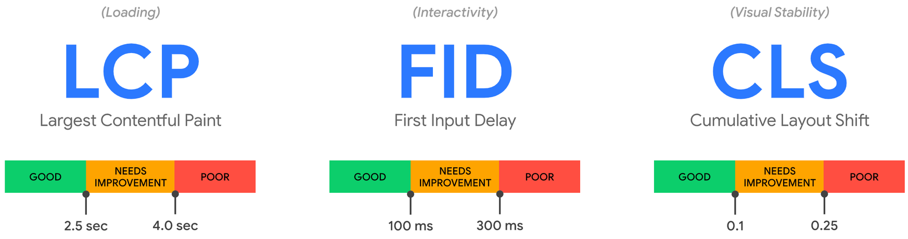

Core Web Vitals (CWVs) are a set of quality signals that have become canonical across the web for measuring the core aspects of what comprises a great user experience in web apps and websites. They help developers understand where their application stands in terms of how delightful it is to use.

CWVs are distinct, measurable facets that represent the duration of time it took an application or site to perform a task that directly affected its user. These tasks are currently categorized by the following performance concerns: Loading, Interactivity, and Visual Stability. Each metric that fits within these categories has a defined range of timing thresholds that helps you determine how a particular metric is faring. At Datadog, we recommend monitoring the 75th percentile for each of these metrics:

#### Largest Contentful Paint (LCP)
This measures loading performance. Specifically, the moment in a page-loading timeline in which the largest DOM object in the viewport is rendered and becomes visible on the screen.

The recommended LCP target value is less than 2.5 seconds.

#### First Input Delay (FID)
This measures interactivity. Specifically, the time that has elapsed between a user’s first interaction with a page and the browsers response to it.

An optimal FID range is around 100 milliseconds or less.

#### Cumulative Layout Shift (CLS)
This measurement quantifies the visual stability of a page. It factors in any unexpected page movement that is a result of dynamically loaded content (such as third party ads). The measurement begins at 0, which means no layout shifts have occurred.

An optimal CLS range is around 0.1 or less.

### Why is tracking CWVs Important?
Tracking CWVs is a vital part of the development process because it fundamentally relates to the success of your web app, both in terms of the user experience and general customer adoption (more on the business impact of monitoring CWVs can be found here). Also, these measurements were recently added to Google’s search algorithm and now directly affect the SEO ranking of your page.

Ready to put CWVs into action? Let’s jump in!