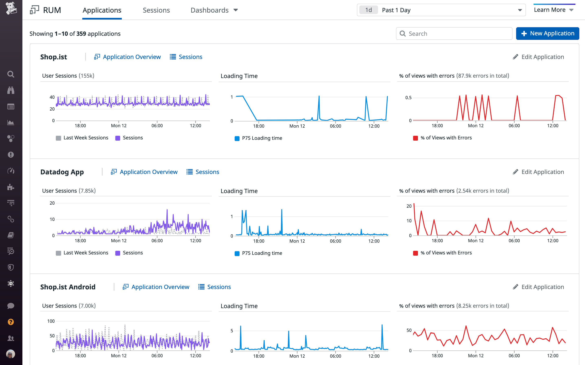
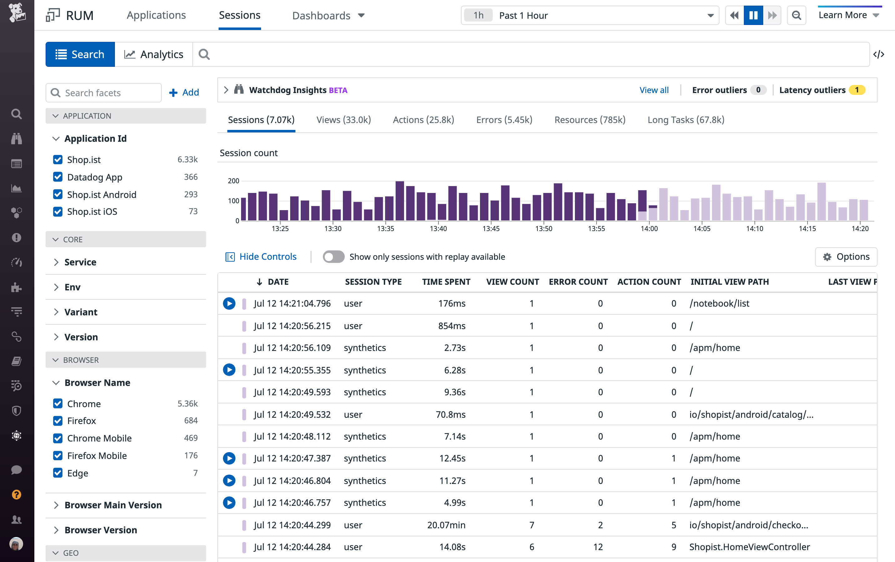
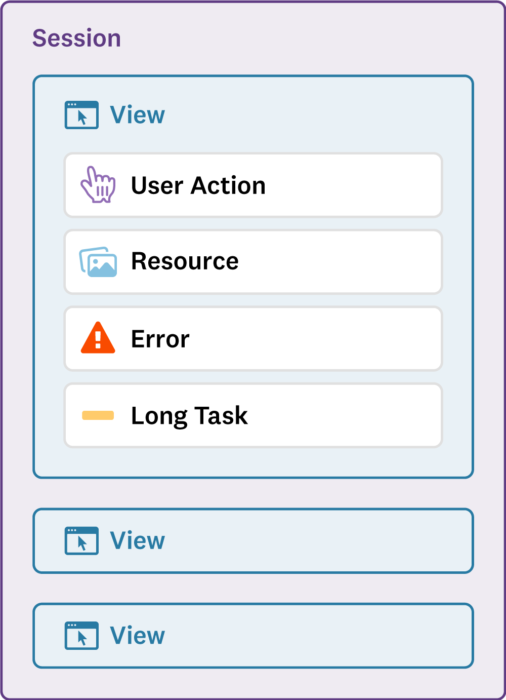
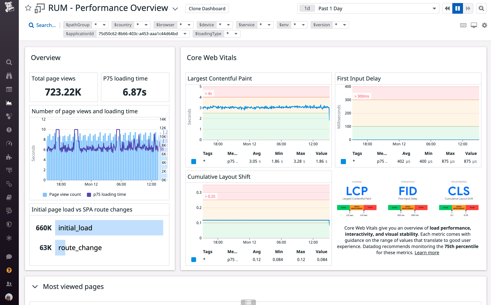

Datadog RUM enables you to visualize and analyze the real-time performance and user journeys of your application’s individual users.

The **Applications** page displays the list of applications that are being monitored using Datadog RUM, along with timeseries graphs for the User Sessions, Loading Times, and % of views with errors for each application. 

For each application, you can view the **Application Overview** dashboard or the **Sessions Explorer** filtered to that application.

 

The <a href="https://docs.datadoghq.com/real_user_monitoring/explorer/" target="_blank">**Sessions Explorer**</a> allows you to explore all data collected from your different applications. It gives you access to granular information about your RUM events, allowing you to do the following and more:
- Navigate user sessions
- Investigate performance issues affecting views, resources or actions
- Troubleshoot application errors

A **session** consists of **views**. A **view** consists of **user actions**, **resources**, **errors**, and **long tasks**. All six of these are **RUM events**.

A user **session** begins when a user starts browsing the web application. It contains high-level information about the user (browser, device, geolocation). It aggregates all RUM events collected during the user journey with a unique `session.id` attribute.

A **view** event is generated each time a user visits a page of the web application. While the user remains on the same page, resource, long-task, error, and action events are linked to the related RUM view with the `view.id` attribute.

A **resource** event is generated for images, XHR, Fetch, CSS, or JS libraries loaded on a webpage. It includes detailed loading timing information.

A **long task** event is generated for any task in the browser that blocks the main thread for more than 50ms.

RUM collects every frontend **error** event emitted by the browser.

RUM **action** events track user interactions during a user journey and can also be manually sent to monitor custom user actions.

When you create a RUM application, special **Dashboards** are created within Datadog to analyze all the RUM data collected. CWVs are visualized in the **Performance Overview dashboard**, which offers a bird’s-eye view of a RUM application. It is separated into three sections:
- Performance metrics - Highlights four browser metrics for all views, : Loading Time, First Contentful Paint, DOM Content Loaded, and Load Event. For each one of these metrics, widgets show the median, the 75th percentile, and the 90th percentile.
- Trends - Visualizes the evolution of page views, frontend errors related to backend calls failing, JS errors, and long tasks.
- Page views breakdown: Analyzes the nature of your traffic and the associated loading time for each segment.

