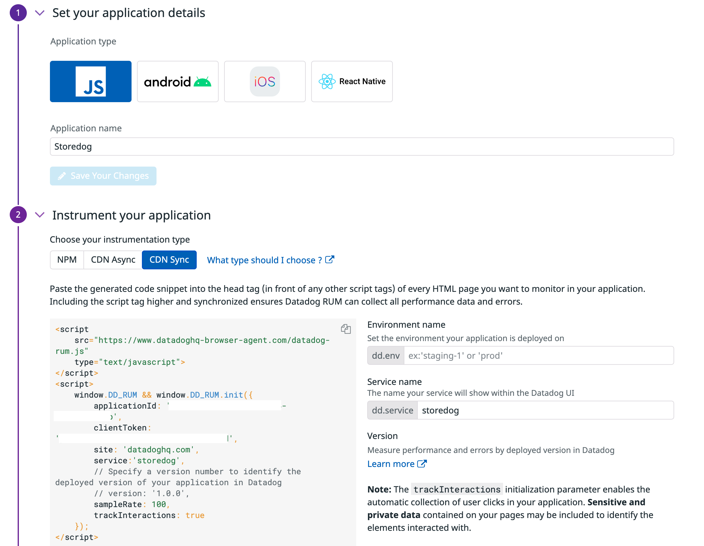

bbb

1. To get started with RUM, you need to set up a Datadog RUM application. Navigate to the <a href="https://app.datadoghq.com/rum/list" target="_datadog">**UX Monitoring > Rum Applications**</a>.

2. Click **New Application**.

3. Under **Set your application details**, select **JS** as the **Application type** because you are integrating the app using Javascript.

    Enter **Storedog** as the **Application name**.

    Click **Create New RUM Application**.

4. If you are using NPM to manage dependencies for your project front end, you can integrate RUM using the `@datadog/browser-rum` package. However, here we are just going to add the JavaScript inline, so select the `CDN Sync` tab:
    

5. On the right, click the `IDE` tab. It may take a few seconds to load. 

    Once the IDE loads, open the file `store-frontend-instrumented-fixed/store-frontend/app/views/layouts/application.html.erb`{{open}}. This Ruby file is the main template for the Storedog app. By integrating the RUM script here, RUM will be available throughout the application.

    **Lines ##** are the RUM script in the front end and set the initialization arguments. This code may be slightly outdated (and different) than the current code snippet in the Datadog UI. It will still work.

    Notice that you code snippet includes environment variables for `applicationId` and `clientToken`.

6. Click the Terminal tab on the right. Set the env `applicationId` and `clientToken` using environment variables:
    
    Copy the `applicationId` from the RUM UI page. In the terminal, assign the value you copied to to `DD_APPLICATION_ID` using the `export` command: `export DD_APPLICATION_ID=xxxxxxxxxxxxxxxxxxxxxxxxxxxxxxxxxxx`

    Copy the `clientToken` from the RUM UI page. In the terminal, assign the value you copied to to `DD_CLIENT_TOKEN` using the `export` command: `export DD_CLIENT_TOKEN=xxxxxxxxxxxxxxxxxxxxxxxxxxxxxxxxxxx`
    
    Run this command to verify that you saved the variables: `echo $DD_CLIENT_TOKEN $DD_APPLICATION_ID`{{execute}}

7. Click `docker-compose up -d`{{execute}} to start the storedog app. Docker will pick up the environment variables you set in the host and pass them along to the containers. Once the app is running, you will see the following in the terminal.